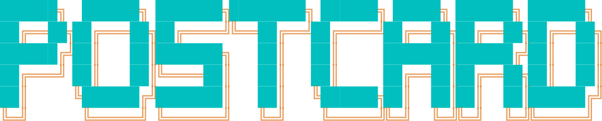
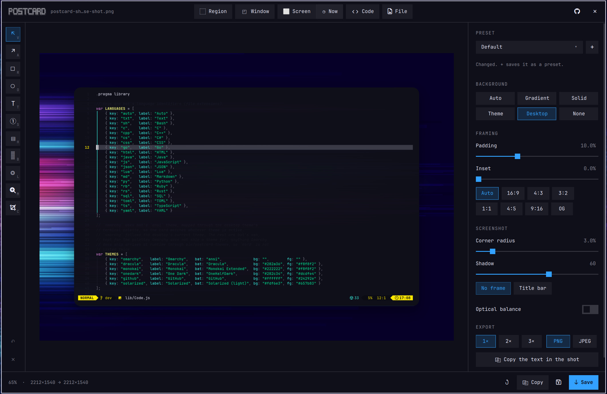
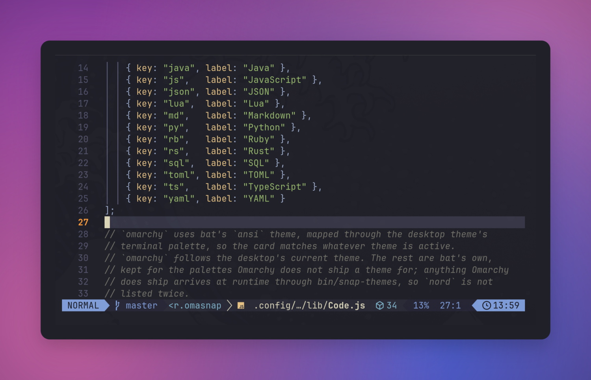
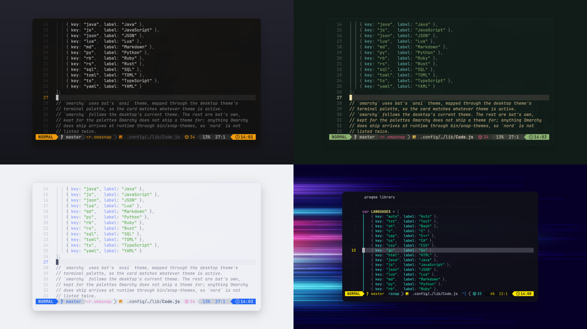
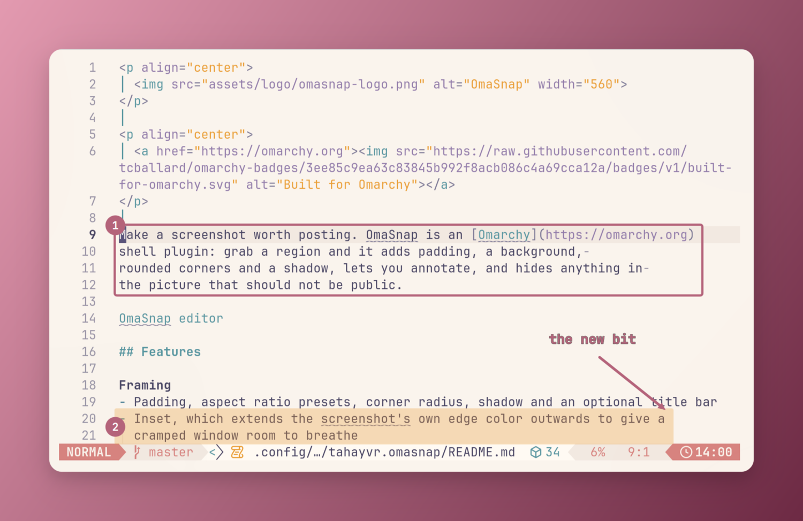
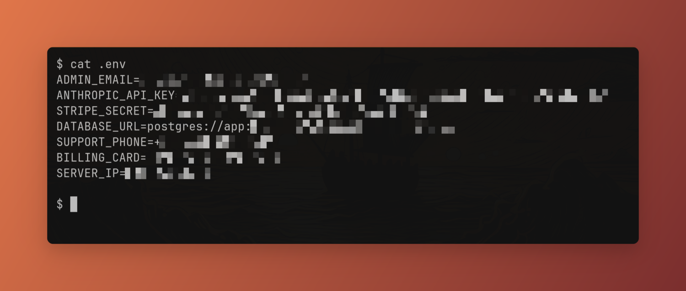
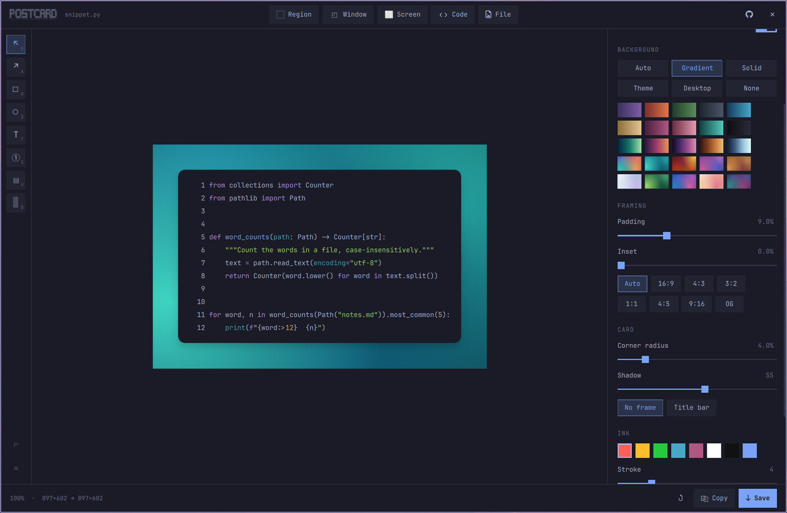

<p align="center">
  
</p>

<p align="center">
  <a href="https://omarchy.org"></a>
</p>

<p align="center">
  <a href="#features">Features</a> ·
  <a href="#install">Install</a> ·
  <a href="#usage">Usage</a> ·
  <a href="#keys">Keys</a> ·
  <a href="#scripting">Scripting</a> ·
  <a href="#dependencies">Dependencies</a> ·
  <a href="#licence">Licence</a>
</p>

Make a screenshot worth posting. Postcard is an [Omarchy](https://omarchy.org)
shell plugin: grab a region and it adds padding, a background,
rounded corners and a shadow, lets you annotate, and hides anything in
the picture that should not be public.



## Features

**Framing**

- Padding, aspect ratio presets, corner radius, crop, shadow and an optional title bar
- Inset, which extends the screenshot's own edge color outwards to give a
  cramped window room to breathe



**Backgrounds**

- Auto from the screenshot, gradients, flat colors, your Omarchy theme, your wallpaper,
  or none for a transparent PNG
- Your own colors and gradients: a picker with a screen eyedropper, and saved
  gradients of two to four colors at any angle, kept across restarts



**Annotation**

- Arrows, boxes, ellipses, highlighter, text labels and numbered steps
- Spotlight a rectangle or an ellipse and the rest of the screenshot dims,
  leaving the background as it is
- Magnify: drag over a detail and a zoomed lens (2×, 3× or 4×) appears beside it,
  joined by a line; move the lens and the magnified spot separately
- Drag to move, and they stay pinned to the screenshot when you reframe



**Hide sensitive data**

- One click pixelates emails, API keys, JWTs, AWS and GitHub tokens, card
  numbers, IBANs, IP addresses and phone numbers, each category switchable
- Card numbers are Luhn-checked; dates, versions, hashes and loopback
  addresses are left alone
- Pixelation is destructive, not a blur that can be undone
- Or copy the screenshot's text to the clipboard



**Code cards**

- Any selected text becomes a syntax-highlighted card in the same frame
- Language detected or chosen, font size, line numbers
- Every Omarchy theme you have installed, plus Dracula, Monokai, One Dark,
  GitHub and Solarized



**Presets**

- Save the whole look (background, framing, corners, shadow, export settings and
  code card style) as a named preset and switch between them from the top of the
  panel; annotations are never part of one
- The preset you pick stays in use after a restart, so it is where every capture
  starts
- Kept in `~/.config/postcard/presets.json`

**Output**

- Clipboard or disk, PNG or JPEG, at 1x, 2x or 3x
- The preview is the file

## Install

```sh
omarchy plugin add https://github.com/tahayvr/postcard.git --enable
```

Update it with `omarchy plugin update tahayvr.postcard`

Remove it with `omarchy plugin remove tahayvr.postcard`,

or `omarchy plugin disable tahayvr.postcard` to keep it installed but off.

Plugins run as unsandboxed code inside your shell process. Read the source
before you enable it.

## Usage

Enabling the plugin puts an Postcard button 󰆟 in the bar. Left-click it to grab a
region or window, middle-click to make a code card from the selected text, right-click
for a menu: region, window, screen with an optional delay, code card, or the editor. Move it with:

```sh
omarchy bar move tahayvr.postcard --section center
```

Or bind keys in `~/.config/hypr/bindings.lua`:

```lua
o.bind("SUPER + SHIFT + PRINT", "Postcard", "omarchy-shell shell summon tahayvr.postcard '{\"capture\":\"region\"}'")
o.bind("SUPER + SHIFT + C", "Postcard code card", "omarchy-shell shell summon tahayvr.postcard '{\"code\":true}'")
o.bind("SUPER + SHIFT + S", "Postcard editor", "omarchy-shell shell toggle tahayvr.postcard '{}'")
```

The buttons at the top of the editor grab a region, window or screen, make a
code card, or open a file. A code card takes the primary selection, or the
clipboard if nothing is highlighted.

### Keys

| Key                                              | Action                                                                  |
| ------------------------------------------------ | ----------------------------------------------------------------------- |
| `V`, `A`, `R`, `O`, `T`, `S`, `H`, `B`, `L`, `M`, `C` | move, arrow, box, ellipse, text, step, highlight, hide, spotlight, magnify, crop |
| `Ctrl+C` / `Ctrl+S`                              | copy / save                                                             |
| `Ctrl+Shift+S`                                   | Save as, through the system file dialog                                 |
| `Ctrl+Z`                                         | undo                                                                    |
| `Ctrl+Shift+Z` / `Ctrl+Y`                        | redo                                                                    |
| `Ctrl+N`                                         | Grab another region                                                     |
| `Ctrl+K`                                         | Code card from the selected text                                        |
| `Delete`                                         | Remove the selected annotation                                          |
| `Enter`                                          | Finish typing a text label                                              |
| `Esc`                                            | Deselect, then close                                                    |

### Scripting

Every call returns `ok`, or a short reason such as `busy` or `no shot`. The shell
requires an argument after the function name, so a function that takes nothing
gets an empty `''`:

```sh
omarchy-shell shell call tahayvr.postcard edit ~/Pictures/Screenshots/shot.png
omarchy-shell shell call tahayvr.postcard capture fullscreen   # region | windows | fullscreen | smart
omarchy-shell shell call tahayvr.postcard capture '{"mode":"fullscreen","delay":5}'   # after 0–60 seconds
omarchy-shell shell hide tahayvr.postcard                      # cancel a pending capture
omarchy-shell shell call tahayvr.postcard code ''               # code card from the selection (or pass the text)
omarchy-shell shell call tahayvr.postcard pick ''               # system file picker
omarchy-shell shell call tahayvr.postcard set '{"codeTheme":"nord","padding":8,"frame":"titlebar"}'
omarchy-shell shell call tahayvr.postcard preset social-post   # "Social Post": a dash for each space; or default
omarchy-shell shell call tahayvr.postcard annotate '{"kind":"box","x":40,"y":40,"w":300,"h":120}'
omarchy-shell shell call tahayvr.postcard crop '{"x":80,"y":40,"w":900,"h":600}'   # or '' for the selection
omarchy-shell shell call tahayvr.postcard uncrop ''            # back to the whole picture
omarchy-shell shell call tahayvr.postcard info ''               # the document as JSON
omarchy-shell shell call tahayvr.postcard redact ''            # find and hide secrets
omarchy-shell shell call tahayvr.postcard copyText ''          # text to the clipboard
omarchy-shell shell call tahayvr.postcard save ''              # export to disk (and clipboard)
omarchy-shell shell call tahayvr.postcard saveAs ''            # export, choosing the file
omarchy-shell shell call tahayvr.postcard copy ''              # export to the clipboard
```

## Dependencies

All of these ship with Omarchy:

- `omarchy`
- `bat`
- `imagemagick`
- `tesseract`
- `wl-clipboard`
- `python-gobject`
- `xdg-desktop-portal`

Postcards are read from and saved to the directory Omarchy uses
(`$OMARCHY_SCREENSHOT_DIR`, else `$XDG_PICTURES_DIR`, else `~/Pictures`) as
`postcard-<date>_<time>.png`. OCR follows `$OMARCHY_OCR_LANGS`.

## Licence

MIT
