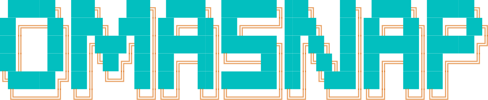

<p align="center">
  
</p>

<p align="center">
  <a href="https://omarchy.org"></a>
</p>

Make a screenshot worth posting. OmaSnap is an [Omarchy](https://omarchy.org)
shell plugin: grab a region and it adds padding, a background, 
rounded corners and a shadow, lets you annotate, and hides anything in 
the picture that should not be public.


## Features

**Framing**
- Padding, aspect ratio presets, corner radius, shadow and an optional title bar
- Inset, which extends the screenshot's own edge color outwards to give a
  cramped window room to breathe


**Backgrounds**
- Auto from the screenshot, gradients, flat colors, your Omarchy theme, your wallpaper,
  or none for a transparent PNG


**Annotation**
- Arrows, boxes, ellipses, highlighter, text labels and numbered steps
- Drag to move, and they stay pinned to the Snap when you reframe


**Hide sensitive data**
- One click pixelates emails, API keys, JWTs, AWS and GitHub tokens, card
  numbers, IBANs, IP addresses and phone numbers, each category switchable
- Card numbers are Luhn-checked; dates, versions, hashes and loopback
  addresses are left alone
- Pixelation is destructive, not a blur that can be undone
- Or copy the screenshot's text to the clipboard


**Code cards**
- Any selected text becomes a syntax-highlighted card in the same frame
- Language detected or chosen, font size, line numbers
- Every Omarchy theme you have installed, plus Dracula, Monokai, One Dark,
  GitHub and Solarized


**Output**
- Clipboard or disk, PNG or JPEG, at 1x, 2x or 3x
- The preview is the file

## Install

```sh
omarchy plugin add https://github.com/tahayvr/omasnap.git --enable
```

Remove it with `omarchy plugin remove tahayvr.omasnap`, or `omarchy plugin
disable tahayvr.omasnap` to keep it installed but off.

Plugins run as unsandboxed code inside your shell process. Read the source
before you enable it.

## Usage

Enabling the plugin puts an OmaSnap button 󰆟  in the bar. Left-click it to grab a
region, middle-click to make a code card from the selected text, right-click
for a menu: region, window, code card, or the editor. Move it with:

```sh
omarchy bar move tahayvr.omasnap --section center
```

Or bind keys in `~/.config/hypr/bindings.lua`:

```lua
o.bind("SUPER + SHIFT + PRINT", "OmaSnap", "omarchy-shell shell summon tahayvr.omasnap '{\"capture\":\"region\"}'")
o.bind("SUPER + SHIFT + C", "OmaSnap code card", "omarchy-shell shell summon tahayvr.omasnap '{\"code\":true}'")
o.bind("SUPER + SHIFT + S", "OmaSnap editor", "omarchy-shell shell toggle tahayvr.omasnap '{}'")
```

The buttons at the top of the editor grab a region, window or screen, make a
code card, or open a file. A code card takes the primary selection, or the
clipboard if nothing is highlighted.

### Keys

| Key | Action |
| --- | --- |
| `V`, `A`, `R`, `O`, `T`, `S`, `H`, `B` | move, arrow, box, ellipse, text, step, highlight, hide |
| `Ctrl+C` / `Ctrl+S` | copy / save |
| `Ctrl+Z` | undo |
| `Ctrl+N` | Grab another region |
| `Ctrl+K` | Code card from the selected text |
| `Delete` | Remove the selected annotation |
| `Enter` | Finish typing a text label |
| `Esc` | Deselect, then close |

### Scripting

Every call returns `ok`, or a short reason such as `busy` or `no shot`:

```sh
omarchy-shell shell call tahayvr.omasnap edit ~/Pictures/Screenshots/snap.png
omarchy-shell shell call tahayvr.omasnap capture fullscreen   # region | windows | fullscreen | smart
omarchy-shell shell call tahayvr.omasnap code ''               # code card from the selection (or pass the text)
omarchy-shell shell call tahayvr.omasnap pick ''               # system file picker
omarchy-shell shell call tahayvr.omasnap set '{"codeTheme":"nord","padding":8,"frame":"titlebar"}'
omarchy-shell shell call tahayvr.omasnap annotate '{"kind":"box","x":40,"y":40,"w":300,"h":120}'
omarchy-shell shell call tahayvr.omasnap info ''               # the document as JSON
omarchy-shell shell call tahayvr.omasnap redact ''            # find and hide secrets
omarchy-shell shell call tahayvr.omasnap copyText ''          # text to the clipboard
omarchy-shell shell call tahayvr.omasnap save ''              # export to disk (and clipboard)
omarchy-shell shell call tahayvr.omasnap copy ''              # export to the clipboard
```

## Dependencies

All of these ship with Omarchy:

- `omarchy`
- `bat`
- `imagemagick`
- `tesseract`
- `wl-clipboard`
- `python-gobject`
- `xdg-desktop-portal`

Snaps are read from and saved to the directory Omarchy uses
(`$OMARCHY_SCREENSHOT_DIR`, else `$XDG_PICTURES_DIR`, else `~/Pictures`) as
`snap-<date>_<time>.png`. OCR follows `$OMARCHY_OCR_LANGS`.

## Licence

MIT
