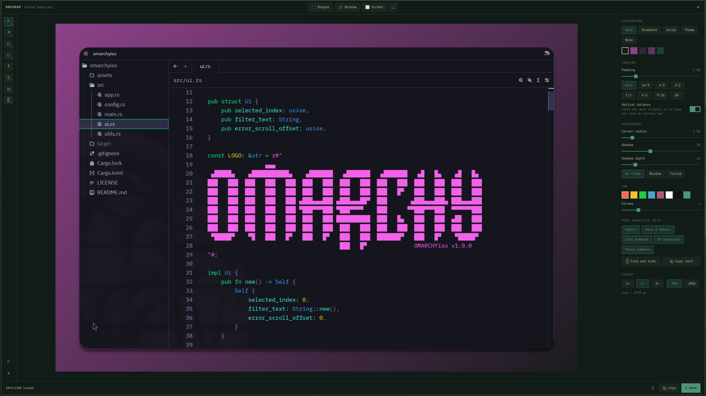

# OmaSnap

Make a screenshot worth posting. OmaSnap is an [Omarchy](https://omarchy.org)
shell plugin: grab a region and it adds padding, a background, 
rounded corners and a shadow, lets you annotate, and hides anything in 
the picture that should not be public.



## Features

**Framing**
- Padding as a percentage of the shot's longest edge, so one value looks the
  same on a small crop and a 4K grab
- Aspect ratio presets, including 1:1, 9:16 and the 1.91:1 used by link
  previews, with optical balance so the shot does not sit low in a tall frame
- Corner radius, shadow depth, and an optional window frame with traffic
  lights or a title

**Backgrounds**
- Auto, sampled from the screenshot itself and kept in a comfortable range so
  a white UI does not give a blinding backdrop
- Gradient presets, flat colours, or the colours of your current Omarchy theme
- None, for a transparent PNG

**Annotation**
- Arrows, boxes, ellipses, highlighter, text labels and numbered step badges
- Select an annotation to drag it; a selected text label takes what you type
- Annotations stay pinned to the screenshot when you change padding or ratio

**Hide sensitive data**
- One click finds and pixelates emails, API keys, JWTs, AWS keys, GitHub
  tokens, card numbers, IBANs, IP addresses and phone numbers
- Each category can be switched off
- Card numbers are Luhn-checked and dates, version numbers, hashes and
  loopback addresses are left alone
- Pixelation destroys the original pixels; it is not a blur that can be undone
- Copy all text in the screenshot to the clipboard

**Output**
- Copy to clipboard or save to disk, at 1×, 2× or 3×
- PNG, or JPEG with a quality setting
- What you see in the preview is what lands in the file

## Install

```sh
omarchy plugin add https://github.com/tahayvr/omasnap.git --enable
```

Plugins run as unsandboxed code inside your shell process. Read the source
before you enable it.

## Usage

Enabling the plugin puts an OmaSnap button in the bar. Left-click it to grab a
region, right-click to reopen the editor on whatever you edited last. Move it
with:

```sh
omarchy bar move tahayvr.omasnap --section center
```

Or bind keys in `~/.config/hypr/bindings.lua`:

```lua
o.bind("SUPER + SHIFT + PRINT", "OmaSnap", "omarchy-shell shell summon tahayvr.omasnap '{\"capture\":\"region\"}'")
o.bind("SUPER + SHIFT + S", "OmaSnap editor", "omarchy-shell shell toggle tahayvr.omasnap '{}'")
```

Inside the editor, the buttons at the top grab a new region, window or full
screen, or open an existing file.

### Keys

| Key | Action |
| --- | --- |
| `V` `A` `R` `O` `T` `S` `H` `B` | Move, arrow, box, ellipse, text, step, highlight, hide |
| `Ctrl+C` / `Ctrl+S` | Copy / save |
| `Ctrl+Z` | Undo |
| `Ctrl+N` | Grab another region |
| `Delete` | Remove the selected annotation |
| `Enter` | Finish typing a text label |
| `Esc` | Deselect, then close |

### Scripting

Every call returns `ok`, or a short reason such as `busy` or `no shot`:

```sh
omarchy-shell shell call tahayvr.omasnap edit ~/Pictures/Screenshots/shot.png
omarchy-shell shell call tahayvr.omasnap capture fullscreen   # region | windows | fullscreen | smart
omarchy-shell shell call tahayvr.omasnap redact ''            # find and hide secrets
omarchy-shell shell call tahayvr.omasnap copyText ''          # text to the clipboard
omarchy-shell shell call tahayvr.omasnap save ''              # export to disk (and clipboard)
omarchy-shell shell call tahayvr.omasnap copy ''              # export to the clipboard
```

## Dependencies

Everything optional degrades rather than breaking.

| Tool | Needed for | Without it |
| --- | --- | --- |
| `omarchy` | Capture | Falls back to `grim` + `slurp` |
| `imagemagick` | Auto background, JPEG export, sharper OCR | Auto background falls back to a flat colour |
| `tesseract` | Hiding sensitive data, copying text | Those two buttons report that it is missing |
| `wl-clipboard` | Copy to clipboard | Save to disk still works |
| `zenity` or `fuzzel` | Opening an existing file | Falls back to the most recent screenshot |

Screenshots are read from and written to the directory Omarchy uses:
`$OMARCHY_SCREENSHOT_DIR`, else `$XDG_PICTURES_DIR`, else `~/Pictures`. OCR
uses `$OMARCHY_OCR_LANGS` (default `eng`), like `omarchy capture text`.

Saved files are named `snap-<date>_<time>.png` (or `.jpg`). On a fractionally
scaled monitor the file can be one pixel off the size shown in the footer.

## Licence

MIT. See `LICENSE`.
